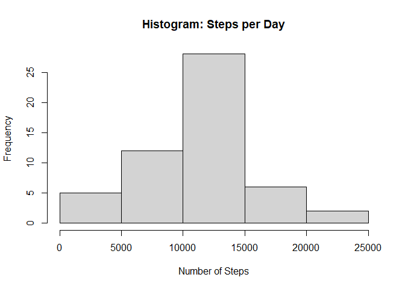
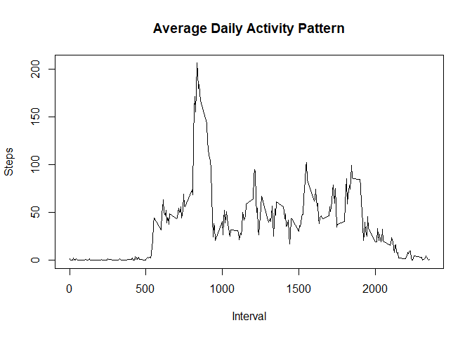
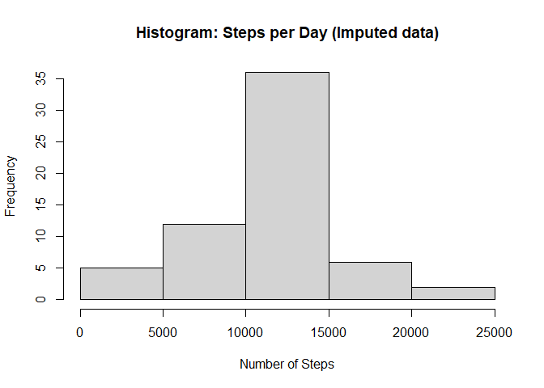
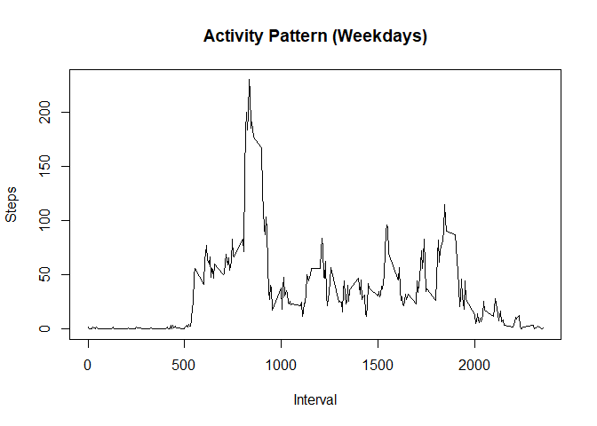
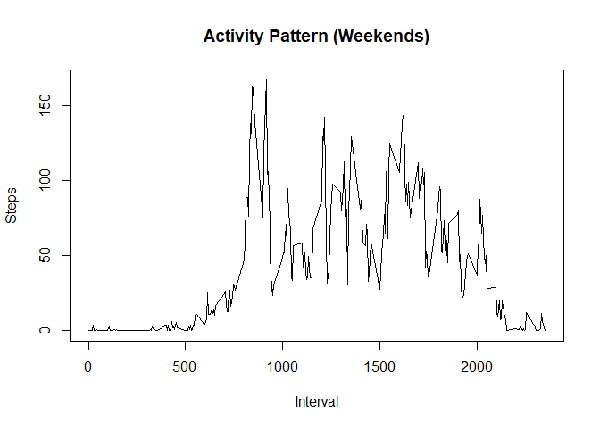

## Loading and preprocessing the data

```r
unzip("./activity.zip")
activityData <- read.csv("./activity.csv")
summary(activityData)
```

```
##      steps            date              interval     
##  Min.   :  0.00   Length:17568       Min.   :   0.0  
##  1st Qu.:  0.00   Class :character   1st Qu.: 588.8  
##  Median :  0.00   Mode  :character   Median :1177.5  
##  Mean   : 37.38                      Mean   :1177.5  
##  3rd Qu.: 12.00                      3rd Qu.:1766.2  
##  Max.   :806.00                      Max.   :2355.0  
##  NA's   :2304
```

```r
names(activityData)
```

```
## [1] "steps"    "date"     "interval"
```

```r
head(activityData)
```

```
##   steps       date interval
## 1    NA 2012-10-01        0
## 2    NA 2012-10-01        5
## 3    NA 2012-10-01       10
## 4    NA 2012-10-01       15
## 5    NA 2012-10-01       20
## 6    NA 2012-10-01       25
```
## What is mean total number of steps taken per day?

```r
stepsperday <- tapply(activityData$steps,    activityData$date, sum)
View(stepsperday)
hist(stepsperday, xlab = "Number of Steps", main = "Histogram: Steps per Day")
```

<!-- -->

```r
meanperday <- mean(stepsperday, na.rm = TRUE)
meanperday
```

```
## [1] 10766.19
```

```r
medianperday <- median(stepsperday, na.rm = TRUE)
medianperday
```

```
## [1] 10765
```
## What is the average daily activity pattern?
## Make a time series plot of the 5-minute interval and average number of steps taken, averaged across all days

```r
StepsPerInterval <- tapply(activityData$steps, activityData$interval, mean, na.rm = TRUE)
plot(as.numeric(names(StepsPerInterval)), 
     StepsPerInterval, 
     xlab = "Interval", 
     ylab = "Steps", 
     main = "Average Daily Activity Pattern", 
     type = "l")
```

<!-- -->
## Which 5-Minute Interval, on average across all the days in the dataset contains the maximum number of steps

```r
maxInterval <- names(sort(StepsPerInterval, decreasing = TRUE)[1])
maxInterval
```

```
## [1] "835"
```

```r
maxSteps <- sort(StepsPerInterval, decreasing = TRUE)[1]
maxSteps
```

```
##      835 
## 206.1698
```
## Imputing missing values
## Calculate and report the total number of missing values in the data set

```r
missingvals <- sum(is.na(activityData$steps))
missingvals
```

```
## [1] 2304
```
## Devise a strategy for filling in all of the missing values in the dataset 
## Create a new dataset that is equal to the original dataset but eith the missing data filled in 

```r
StepsPerInterval <- tapply(activityData$steps, activityData$interval, mean, na.rm = TRUE)
### split activity data by interval
activity.split <- split(activityData, activityData$interval)
### fill in missing data for each interval
for(i in 1:length(activity.split)){
  activity.split[[i]]$steps[is.na(activity.split[[i]]$steps)] <- StepsPerInterval[i]
}
activity.imputed <- do.call("rbind", activity.split)
activity.imputed <- activity.imputed[order(activity.imputed$date) ,]
```
##Make a histogram of the total number of steps taken each day and calculate and report the mean and median total number of steps taken per day

```r
StepsPerDay.imputed <- tapply(activity.imputed$steps, activity.imputed$date, sum)
hist(StepsPerDay.imputed, xlab = "Number of Steps", main = "Histogram: Steps per Day (Imputed data)")
```

<!-- -->

```r
MeanPerDay.imputed <- mean(StepsPerDay.imputed, na.rm = TRUE)
MedianPerDay.imputed <- median(StepsPerDay.imputed, na.rm = TRUE)
```
## Are there differences in activity patterns between weekdays and weekends?

## Create a new factor variable in the dataset with two levels "weekday' and "weekend" indicating whether a given date is a weekday or weekend day

```r
activity.imputed$day <- ifelse(weekdays(as.Date(activity.imputed$date)) == "Saturday" | weekdays(as.Date(activity.imputed$date)) == "Sunday", "weekend", "weekday")
```
## Make a panel plot containing a time series plot of the 5-minute interval and the average number of steps taken, averaged across all weekdays or weekend days
# Calculate average steps per interval for weekends

```r
StepsPerInterval.weekend <- tapply(activity.imputed[activity.imputed$day == "weekend" ,]$steps, activity.imputed[activity.imputed$day == "weekend" ,]$interval, mean, na.rm = TRUE)
```
# Calculate average steps per interval for weekdays

```r
StepsPerInterval.weekday <- tapply(activity.imputed[activity.imputed$day == "weekday" ,]$steps, activity.imputed[activity.imputed$day == "weekday" ,]$interval, mean, na.rm = TRUE)
```
## Set a 2 panel plot

```r
par(mfrow=c(1,2))
```
## Plot weekday activity

```r
plot(as.numeric(names(StepsPerInterval.weekday)), 
     StepsPerInterval.weekday, 
     xlab = "Interval", 
     ylab = "Steps", 
     main = "Activity Pattern (Weekdays)", 
     type = "l")
```

<!-- -->
##Plot weekend activity

```r
plot(as.numeric(names(StepsPerInterval.weekend)), 
     StepsPerInterval.weekend, 
     xlab = "Interval", 
     ylab = "Steps", 
     main = "Activity Pattern (Weekends)", 
     type = "l")
```

<!-- -->
